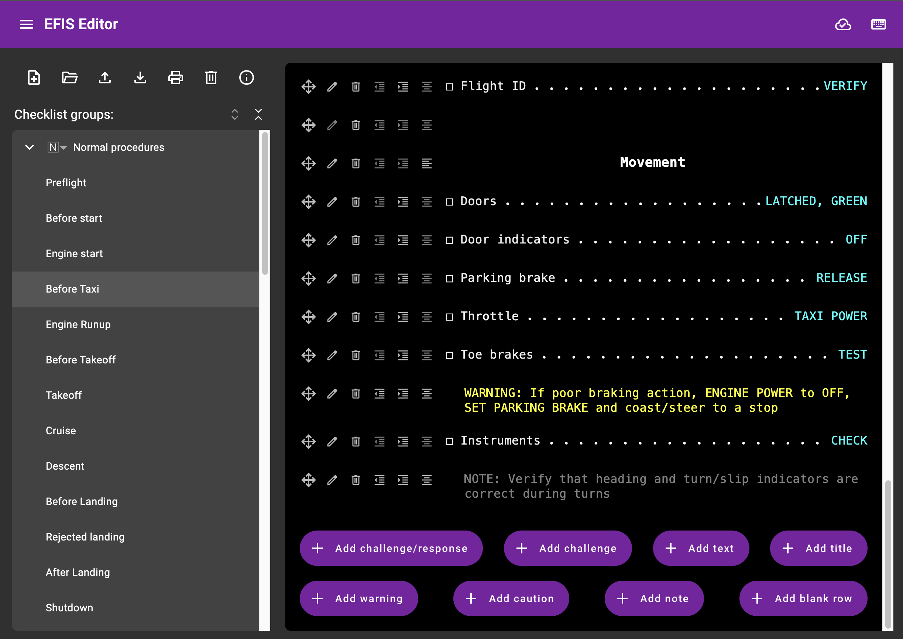

# EFIS file format editor

This is a web-based editor for file formats used by modern EFIS avionics systems on aircraft.

## Using

> [!IMPORTANT]
> First, read the disclaimer below carefully. Then:

:point_right: Head over to https://rdamazio.github.io/efis-editor/. :point_left:

## Preview

You can try it out directly in the link above, but here's what it currently looks like:

## Supported file types:

- Checklists:
  - Advanced Flight systems (AFS)
  - Dynon Skyview
  - Foreflight (.fmd file format) - thanks to [zyv](https://github.com/zyv)!
  - Garmin G3X / G3X Touch / GTN (.ace file format)
  - Grand Rapids (GRT)
  - Printable (PDF) - export only, selectable page size
  - Raw (JSON) - the editor's internal format (for lossless backup purposes)

Different checklist file formats support different subsets of all the features in the editor:

| **Feature**                | Garmin             | AFS/Dynon            | GRT                  | Foreflight           | PDF                |
| -------------------------- | ------------------ | -------------------- | -------------------- | -------------------- | ------------------ |
| Checklist groups           | :white_check_mark: | :white_check_mark: ¹ | :white_check_mark: ¹ | :white_check_mark:   | :white_check_mark: |
| Checklist group categories | :x:                | :x:                  | :x:                  | :white_check_mark:   | :white_check_mark: |
| Item types                 | :white_check_mark: | :white_check_mark: ² | :white_check_mark: ² | :white_check_mark:   | :white_check_mark: |
| Indentation                | :white_check_mark: | :white_check_mark:   | :white_check_mark:   | :x:                  | :white_check_mark: |
| Centering                  | :white_check_mark: | :white_check_mark:   | :white_check_mark:   | :x:                  | :white_check_mark: |
| Default checklist/group    | :white_check_mark: | :x:                  | :x:                  | :x:                  | :x:                |
| Checklist metadata         | :white_check_mark: | :white_check_mark: ³ | :white_check_mark: ³ | :white_check_mark: ⁴ | :white_check_mark: |
| Dynamic data               | :x:                | :x:                  | :white_check_mark:   | :x:                  | :x:                |

¹ Groups names after the first will become part of the exported checklist name 
² Prefixes, suffixes and formatting used to differentiate types 
³ Output as a separate checklist (last) 
⁴ Only file name, aircraft information and make/model (not manufacturer or copyright info) 
 
Internally, files are stored in our own format, so it is possible to import a
file in one format and then export it in another.

## File storage

For now, this is a standalone web app that doesn't talk to any servers. To accomplish this, files are
stored on your browser's local storage. This does mean that if you lose your device or clear your
browser's data, they will be lost - so download your files and keep a copy safe.

## Editor features

- Import/export from the formats above
- Multiple checklist files
- Checklist item editing, reordering, moving within a file
- Checklist renaming, reordering
- Checklist group renaming, reordering
- Checklist metadata editing, including Garmin's default group/checklist
- Keyboard shortcuts for navigation and editing

## Disclaimer

> [!IMPORTANT]
> This is not your usual disclaimer - read it carefully.

> [!CAUTION]
> :skull_and_crossbones: Failure to follow proper procedures can result in serious
> injury or death. :skull_and_crossbones:

Use of files generated by this application on your avionics is at your own risk,
and we make no guarantee that the output will be correct or safe to use. Approach
using these files with the same care that you would any flight testing activity -
we recommend thoroughly testing them before use during actual operations (including
checking them with the manufacturer's recommended apps where available, thoroughly
testing on the ground before flight, having paper copies of your checklists, and any
other precautions you would take when using an avionics configuration that's **_not
supported_** or documented by your avionics manufacturer). We take no responsibility if
it makes your EFIS crash, melt and/or you crash and die while attempting to use
these files. We obviously also take no responsibility for the actual contents of your
checklists, or even guarantee that the contents you enter in this app will
be accurately reflected in your EFIS. Likewise, we make no guarantee that generated
printable files will be correct, complete or safe to use as paper backups.

Experimental aircraft use only - use for certificated aircraft is not authorized.

The authors of this app have no association or relationship with the manufacturers
of the avionics with which these files may be used, and its use is not supported by
or endorsed by any of those companies.

This project is not an official Google project. It is not supported by
Google and Google specifically disclaims all warranties as to its quality,
merchantability, or fitness for a particular purpose.

## License

This project is available as Open Source Software, under the Apache 2.0 license.
See [LICENSE](./LICENSE) for details about copyright and redistribution.

## Contributing

We welcome outside contributions, and there's plenty of things to do, so
don't be shy. Please ask if you want a pointer on something you can help with,
and hopefully we can all figure something out.

We do have [a few policies and
suggestions](https://github.com/rdamazio/efis-editor/blob/main/docs/contributing.md)
for contributors. The broad TL;DR:

- Bug reports are very welcome!
- Every commit that lands in the `main` branch is code reviewed.
- Please behave yourself, and obey the Community Guidelines.
- There **is** a mandatory CLA you must agree to. Importantly, it **does not**
  transfer copyright ownership to Google or anyone else; it simply gives us the
  right to safely redistribute and use your changes.

### Contributions wanted

This is a short list of known areas where contributions would be helpful:

- **UI refinement**: As a backend developer (heck, nowadays I'm not even that, just a manager),
  my CSS-foo is quite limited. If you see something that looks odd, please send a PR!
- **Format testing**: I have not tested these files on anything but Garmin avionics and
  ForeFlight. Please test and send improvements.
- **Configuration files**: I'd like to support more than just checklists.
- Your favorite missing feature goes here.

## Development setup

The following steps can be followed to set up a development environment:

- If you haven't already, [install Node](https://nodejs.org/en/learn/getting-started/how-to-install-nodejs)
- Clone this project (we recommend using [jj](http://github.com/martinvonz/jj) for that!)
- `npm install` (will install all dependencies into `node_modules/`)
- `npm run genproto` (will generate protocol buffer files into `gen/ts/`)

You can then develop as you normally would any Angular app (e.g. `ng serve`).

If you make changes to `.proto` files, you'll need to run the genproto step again
(or you can use an IDE extension such as [vscode-proto3](https://github.com/zxh0/vscode-proto3) to
do that automatically when the file is saved).
